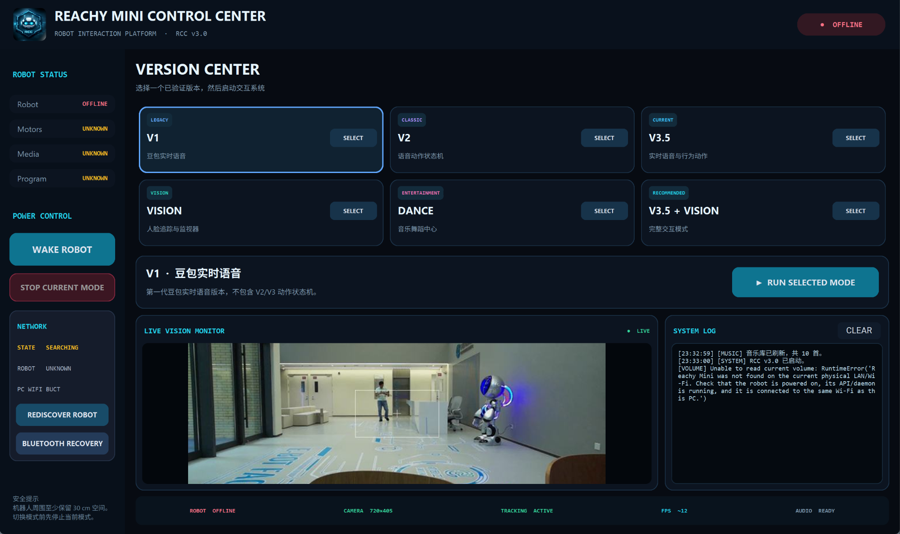

# Reachy Mini RCC

**Reachy Mini Control Center - multimodal voice, motion, vision and dance control for Reachy Mini.**

[](https://github.com/guantianhaoaiyuyang-hub/reachy-mini-rcc/releases/tag/v3.0.0)
[](LICENSE)
[](pyproject.toml)
[](#development-setup)
[](#project-status)

**Current release:** [v3.0.0](https://github.com/guantianhaoaiyuyang-hub/reachy-mini-rcc/releases/tag/v3.0.0)

[Release v3.0.0](https://github.com/guantianhaoaiyuyang-hub/reachy-mini-rcc/releases/tag/v3.0.0) | [Source ZIP](https://github.com/guantianhaoaiyuyang-hub/reachy-mini-rcc/archive/refs/tags/v3.0.0.zip) | [Quick Start](docs/QUICK_START.md) | [Documentation](docs/) | [Security](SECURITY.md)

> This is a community-developed project for Reachy Mini. It is not an official Pollen Robotics product and does not imply affiliation with or endorsement by Pollen Robotics.



*Reachy Mini RCC v3.0.0 main control interface*
## Quick Start

Clone the repository:

```powershell
git clone https://github.com/guantianhaoaiyuyang-hub/reachy-mini-rcc.git
cd reachy-mini-rcc
```

Install the project environment with `uv`:

```powershell
uv sync
```

Launch the RCC:

```powershell
python -m launcher.app
```

For detailed setup instructions, see:

- [Quick Start](docs/QUICK_START.md)
- [Networking](docs/NETWORKING.md)
- [Doubao Setup](docs/DOUBAO_SETUP.md)
- [Troubleshooting](docs/TROUBLESHOOTING.md)

## Overview

Reachy Mini RCC is a Windows-oriented multimodal interaction and robot control project for Reachy Mini.

It integrates realtime conversational voice interaction, robot motion, face tracking, dance playback, robot discovery, network recovery and a desktop graphical control center into one development stack.

## Validated RCC Modes

| Mode | Description |
|---|---|
| **V1** | Realtime conversational interaction baseline |
| **V2** | Voice interaction with motion control |
| **V3.5** | Advanced voice + motion mode |
| **VISION** | MediaPipe-based face tracking |
| **DANCE** | Dance and timeline playback |
| **V3.5 + VISION** | Combined voice/motion interaction and face tracking |

The current module layout is intentionally preserved in v3.0.0. Some production mode modules currently live under the `tests/` package because those exact paths have already been validated.

## Important Runtime Contracts

### V3.5 launch path

```text
RCC
  -> launcher.run_mode
  -> tests.reachy_voice_motion_v3_test
```

### VISION preview

The embedded VISION preview retains the Pillow-based JPEG generation path used by the validated Windows build.

### Robot discovery

Production modes use dynamic Reachy Mini discovery rather than a fixed development-machine robot IP address.

### Reachy Mini hotspot

`10.42.0.1` is intentionally used by Reachy Mini hotspot-mode networking logic.

## Network Preflight

Before launching robot modes, RCC validates robot discovery, daemon connectivity, WLAN state and media connectivity. It can detect stale daemon WLAN state, recover the daemon when required, revalidate the connection and only then launch the selected mode.

## Repository Structure

```text
ReachyMini_RCC_v3.0.0/
|-- README.md
|-- LICENSE
|-- SECURITY.md
|-- CONTRIBUTING.md
|-- THIRD_PARTY_NOTICES.md
|-- .gitignore
|-- .env.example
|-- pyproject.toml
|-- uv.lock
|-- main.py
|-- config/
|-- core/
|-- doubao/
|-- launcher/
|-- robot/
|-- tests/
|-- resources/
|-- installer/
|-- models/
|-- music/
`-- docs/
```

## Development Setup

This repository is a source release. The large standalone Windows runtime is intentionally not included.

If `uv` is available:

```powershell
uv sync
```

Then launch the RCC from the project environment, for example:

```powershell
python -m launcher.app
```

## Doubao Configuration

Real credentials are never included in this repository.

Use `.env.example` only as a development reference. Do not commit actual values for:

```text
DOUBAO_APP_ID
DOUBAO_ACCESS_TOKEN
DOUBAO_APP_KEY
DOUBAO_RESOURCE_ID
DOUBAO_MODEL
```

Installed RCC stores normal configuration under:

```text
%LOCALAPPDATA%\ReachyMiniRCC\settings.json
```

Sensitive values such as the Doubao Access Token and App Key are stored using Windows Credential Manager.

## Security

Never commit `.env`, real access tokens, App Keys, credential exports, private logs, personal recordings, private screenshots or unnecessary machine-specific information.

See `SECURITY.md`.

## Music and Models

Music/audio assets and third-party model files are intentionally excluded unless redistribution rights have been reviewed.

See:

```text
music/README.md
models/README.md
```

## Windows Installer

The repository contains:

```text
installer/ReachyMini_RCC_Setup.iss
```

The compiled installer EXE is not part of the initial source tree.

## Contributing

See `CONTRIBUTING.md`.

Changes affecting V3.5, VISION, V3.5 + VISION, robot discovery, Network Preflight, robot audio, preview transport or credentials require additional regression attention.

## Third-Party Software

See `THIRD_PARTY_NOTICES.md`.

The Apache License 2.0 applied to original project code does not automatically relicense third-party components.

## Project Status

**v3.0.0 - Active Development**

## Author

**Neil Guan**

Copyright 2026 Neil Guan

## License

Original project source owned by the project author and contributors is released under the **Apache License 2.0**.

See `LICENSE`.